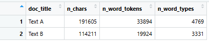
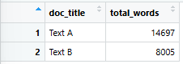
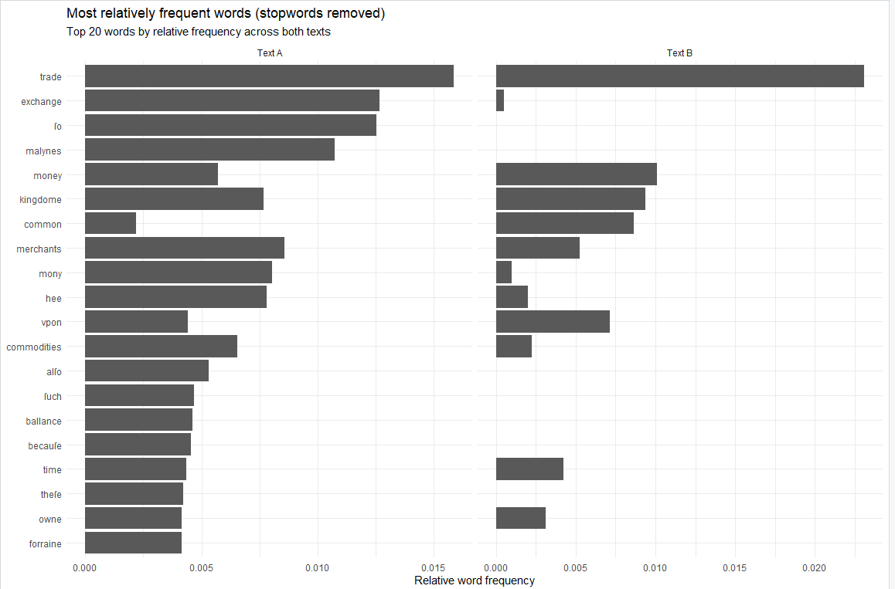

I. Create a diagnostics table (before stopword removal)

II. Interpret the diagnostics (short prose to be shared on Canvas)
In 4–6 sentences, answer:
• Are Text A and Text B comparable in length? (Use your diagnostics numbers.)
They are not. Text A has 191,605 characters, while Text B has 114,211 characters. The length of Text B is less than 60% of the length of Text A.

• If they differ substantially, what does that imply for interpreting raw frequency comparisons?
Since the two texts differ substantially, we must keep in mind that raw frequency comparisons may not be as helpful as relative frequency comparisons (frequency relative to the total length of the respective texts). If the raw frequency of a token is higher in Text A than in Text B, we cannot straight away conclude that the token is more representative in Text A than in Text B. We must also look at the relative frequency and consider that when making the comment of the representation of that token.

III. Compare normalized “trade” across the texts
Total number of words (after stopword removal) in each document.

Relative Frequencies Visualisation

Compare raw counts vs. relative frequencies
word_counts_filtered.png
• Does Text A or Text B use "trade" more proportionally? And how does this compare to what the raw counts suggested?
The raw count suggests that Text A uses more "trade" than Text B (233 : 185); however, Text B uses "trade" more proportionally than Text A (2.31% : 1.59%). This shows that we must not just use raw counts to make conclusions, and must also consider relative frequencies.

• We normalized by dividing each word count by the total words in that document (after stopword removal). How would your results change if you normalized by the original document length (before stopword removal)? Would this be better or worse, and why? [This is a harder question than it would seem at first! Review the lecture notes].
If we normalise the texts using the original document lengths before stopword removal, we would get a much smaller relative frequency for each of the top 20 words that we used that is not part of the stopwords. This is because by definition, stopwords are words that have high frequencies in the document that do not provide substantial meaning for the document. They would increase the denominator for the normalising process, causing non-stopwords which may contribute more meaning for the document to have much smaller relative frequencies than the stopwords. This is worse because when we look at the relative frequency data, we would see it being dominated by stopwords, which do not give us much insight into the meaning of the document. If we removed the stopwords, the relative frequency data we get would show the words that have an impact on the meaning of the document.