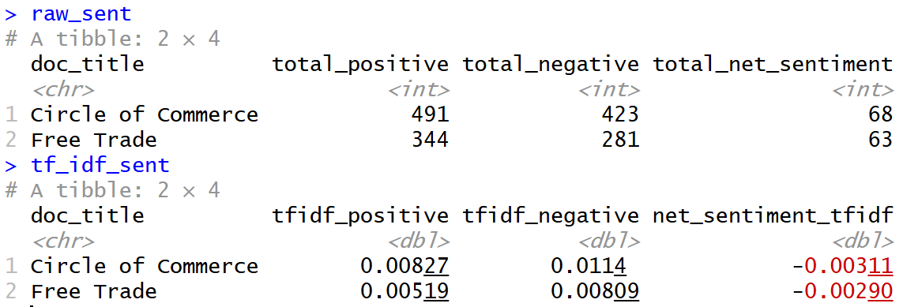
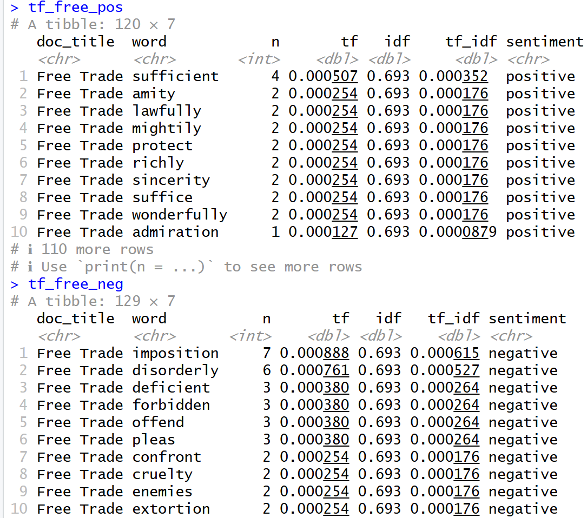
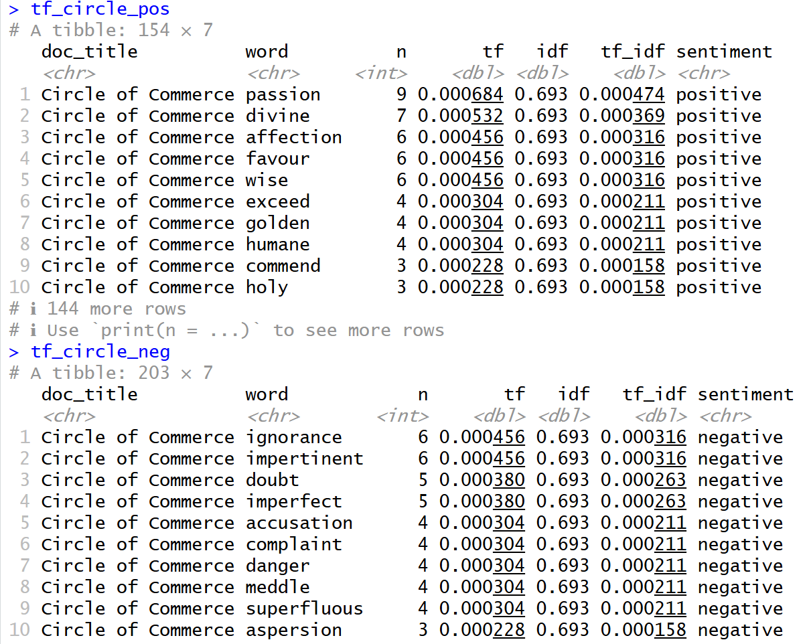

1. What Changed between the two methods?
When we first calculated the net sentiment score for both texts using the raw count, we find both of them to be net-positive. Specifically, after cleaning and normalising the text, we have the results below:

Circle of Commerce: 491 positive vs. 423 negative (net +68)
Free Trade: 344 positive vs. 281 negative (net +63)

Then, when we calculated the sentiment using TF-IDF, we find that both texts are net-negative. Specifically, we get these normalised sentiment scores:

Circle of Commerce: 0.00827 positive vs. 0.0114 negative (net -0.00311)
Free Trade: 0.00519 positive vs. 0.00809 negative (net -0.00290)

The hypothesis of this change is discussed in the next question.

2. Why did TF-IDF alter the results?
TF-IDF normalises the data by giving more weight to tokens/words that appear a lot more in a specific document than others. With this two document corpus, this means that these tokens are more specific and important to their respective documents. 

After applying TF-IDF to both documents, we find that the tokens with higher TF-IDF values are negative across both documents, which altered the net sentiment rating.

Here are the top positive and negative tokens in Free Trade, and note the TF-IDF scores.

Here are the top positive and negative tokens in Circle of Commerce.

3. Which specific words drove the changes?
The words that drove the changes were negative words that have high TF-IDF scores for their respective documents.

For Free Trade, these are: imposition, disorderly, deficient, forbidden, offend.

For Circle of Commerce, these are: ignorance, impertinent, doubt, imperfect, accusation.

4. When would each method be more appropriate?
For Raw Count, I think it is appropriate when we want to find the overall sentiment of a document, and not necessarily comparing across documents in a corpus. For this example, I think it would be more appropriate to use raw count because we only have two documents in the corpus, and they are similar in theme, so therefore many important words tha may have a strong sentiment value are shared and thus made less impactful with TF-IDF.

For TF-IDF, I think it is more appropriate if we were trying to compare sentiments across multiple documents, were the themes and use of vocabulary differ more. The point of using TF-IDF is to normalise the scores so that the common words that are used across vastly different documents in terms of themes, which may mean these words do not have much impact on the meaning of the piece, would only have a dampened effect on the sentiment score.